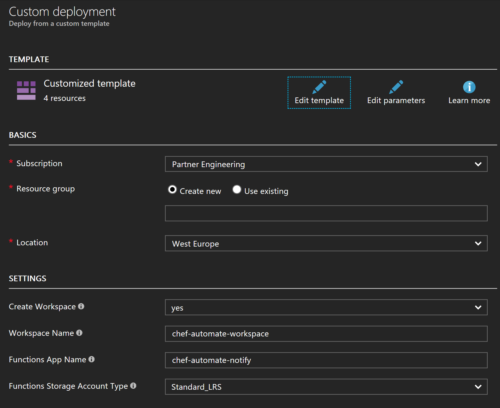
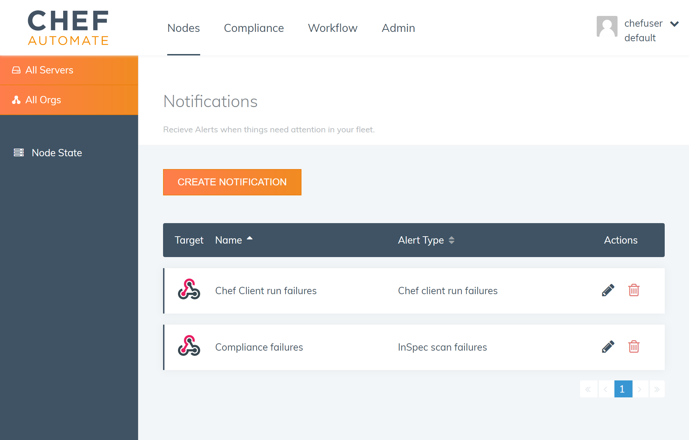

# Log Analytics relay for Chef Automate

Use this Chef Automate Log Analytics integration to channel notification messages such as Chef Client run failures, into Azure Log Analytics.

Read more about this integration in our [introductory blog post](https://blogs.chef.io/tbc).

# How to deploy the template

Simply press the [Deploy to Azure](https://azuredeploy.net/) button above to launch the template within your own Azure Subscription.  You will be asked to provide settings as below.

If you do not have an [Insights & Analytics](https://azure.microsoft.com/en-us/services/insight-analytics/) Workspace, this Azure Resource Manager template can provision you a new one.

An Azure Function is deployed within your Subscription and two endpoint URLs are exposed as Deployment Outputs.  After deployment, make a note of the webhooks that are output by the deployment.

Then, simply visit the Notifications tab within Chef Automate in order to add your custom notification to Chef Automate.

*That's it, you're all set.  Log events may take up to 15 minutes to start processing within Insights & Analytics after their initial generation.*

# Compatibility

You need Chef Automate 1.6.99 or higher to use this integration.  To enable the notifications functionality in Chef Automate 1.6.99 visit the Nodes tab, click on any white space on the page and type "BETA".  A new notifications side menu will appear.

# Licensing

This integration is provided free of charge to customers of Chef Automate. [Charges may apply for usage of Log Analytics](https://azure.microsoft.com/en-us/pricing/details/insight-analytics/).

(c) 2017 Chef Software, Inc.
